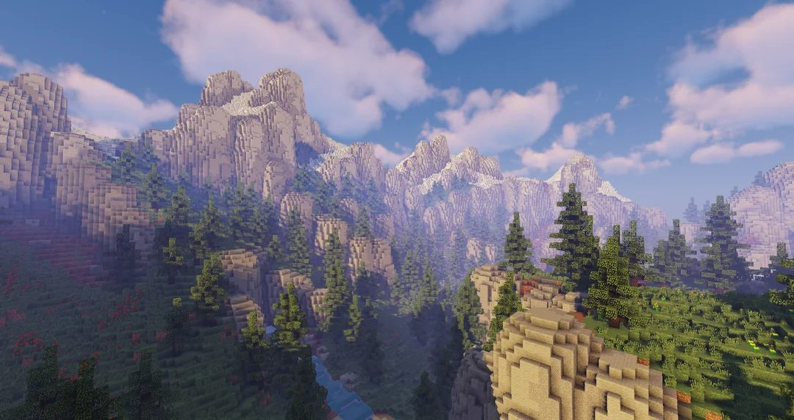

# Victor G — Portfólio

Site portfólio pessoal de edição de vídeos (nicho gaming). Página única, estática, sem frameworks — HTML + CSS puro (com um pouco de JS/animação leve via CSS).

🔗 **Demo:** _adicione aqui o link do GitHub Pages depois de publicar_

## Preview



## Stack

- HTML5 + CSS3 puro (nenhuma dependência de build)
- Fontes via Google Fonts: `Bebas Neue` (títulos), `Space Mono` (labels/timecode), `Inter` (texto corrido)
- Sem JavaScript de terceiros, sem frameworks — carregamento rápido e leve

## Estrutura

```
.
├── index.html   # página principal (hero, trabalhos, contato)
├── bg.jpg       # imagem de fundo (paisagem com blur aplicado via CSS)
└── README.md
```

## Rodando localmente

Não precisa de servidor nem instalação — é só abrir o arquivo:

```bash
git clone https://github.com/SEU-USUARIO/SEU-REPO.git
cd SEU-REPO
open index.html   # ou dois cliques no arquivo
```

## Publicando no GitHub Pages

1. Suba os arquivos (`index.html` e `bg.jpg`) para a raiz do repositório.
2. Vá em **Settings → Pages**.
3. Em **Source**, selecione a branch `main` e a pasta `/ (root)`.
4. Salve — o site fica disponível em `https://SEU-USUARIO.github.io/SEU-REPO/` em alguns minutos.

## Personalizando

- **Vídeos**: a seção "Trabalhos" tem 4 cards placeholder no grid 2x2. Em cada `.card` do `index.html`, troque:
  - o `href` pelo link do vídeo (YouTube, Twitter, Drive etc.)
  - o texto de `.card-title` e `.card-tag`
  - a imagem de fundo do card, se quiser usar uma thumbnail própria em vez do efeito atual
- **Cores**: todas as cores ficam centralizadas no `:root` do CSS (variáveis `--ember`, `--void`, `--bone` etc.) — mudar ali já reflete no site inteiro.
- **Contato**: os três cards de contato (Discord, Email, Twitter) estão na seção `#contato`, já com os dados atuais.

## Contato

- **Discord:** dextermorgan08938
- **Email:** ytanormalguy@gmail.com
- **Twitter:** [@Nerd_editorFR](https://twitter.com/Nerd_editorFR)

---

Feito para divulgar trabalhos de edição de vídeo no nicho gaming.
